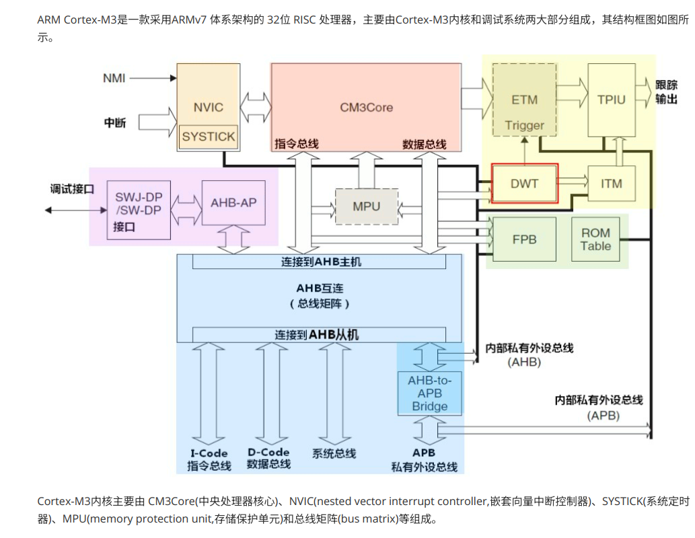
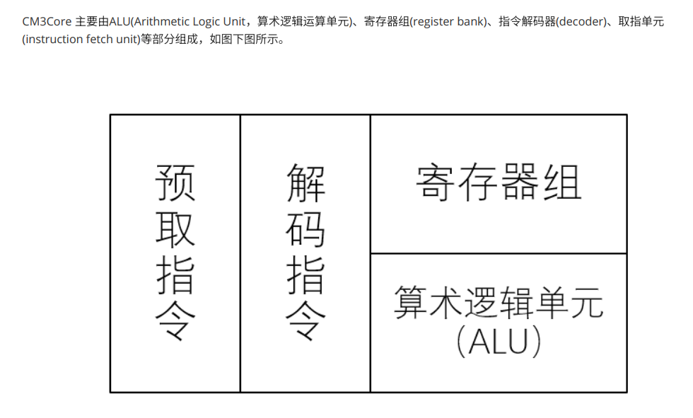
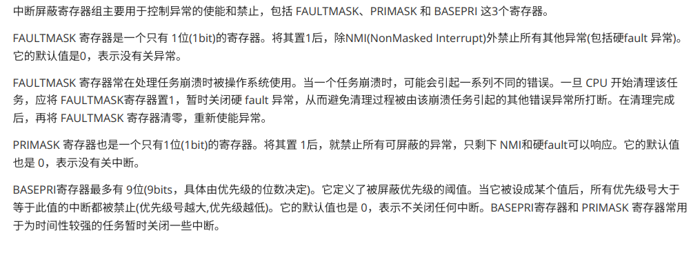
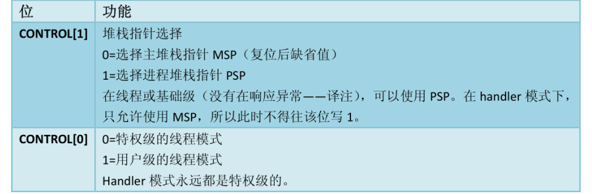
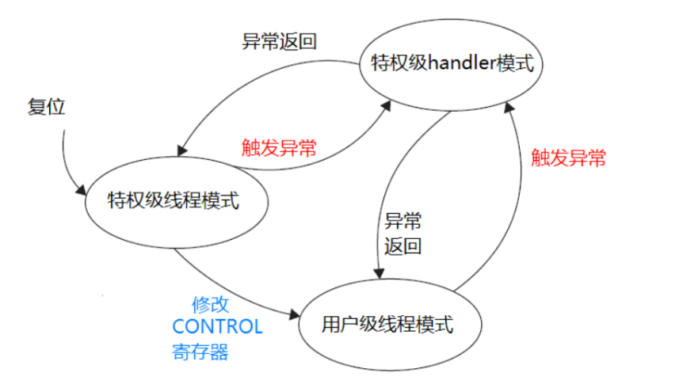
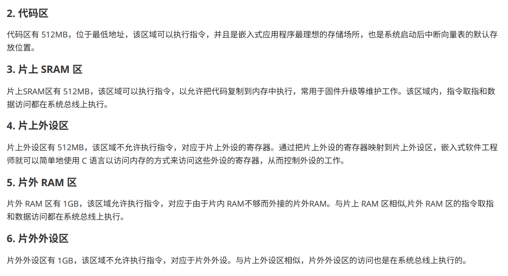

## 1.1 Cortex-M3

### CM3Core是Cortex-M3的中央处理器 采用哈弗结构

### NVIC 中断控制器 采用向量中断机制
### SYSTICK 系统定时器 24位倒计时计数器
### MPU（存储保护单元）
### Bus Matrix (总线矩阵) 32位AHB总线互连网络
### 调试接口
#### Cortex-M3处理器的调试系统主要由 SW-DP/SWJ-DP(Serial Wire-Debug Port / Serial Wire JTAG-Debug Port，串⾏线调试端⼝/串⾏线JTAG调试端⼝)、AHB-AF(Advanced High Performance Bus-Access Port，AHB 访问端⼝)
### 跟踪输出接口
#### Cortex-M3处理器具有指令跟踪(由 ETM 产⽣)、数据跟踪(由 DWT产⽣)和调试信息跟踪(由ITM 产⽣)3 种跟踪源,并⽀持各种跟踪机制
---

## 1.2 Cortex-M3编程模型
### 工作状态
#### 在 Thumb 状态下处理器执⾏ 16 位和32 位半字对⻬的 Thumb-2 指令的状态
#### 在调试状态下，处理器停⽌执⾏并进⾏调试时进⼊该状态
### 数据类型
#### 字节(B)⻓为 8位
#### 半字(halfword)⻓为16位，必须以 2字节对⻬的⽅式存取
#### 字(word)⻓为 32位，必须以4字节对⻬的⽅式存取
### 寄存器
#### R0~R12 通用寄存器
#### R13（SP） 
##### 堆栈指针寄存器 由一块连续的内存和一个堆栈指针组成 常用于临时保存将要或易于被修改的数据，以便将来能够恢复 同一时间，只能有一个SP
##### 1.**主堆栈指针（MSP）** 复位后默认的堆指针 由操作系统内核、异常服务程序以及特权访问的用户使用
##### 2.**进程堆栈指针（PSP）** 由常规用户程序使用
#### R14（LR）链接寄存器 常用于调用子程序时保存返回地址
#### R15（PC）程序计数器 用于存放下一条执行的指令的地址
#### 特殊功能寄存器组
##### 程序状态寄存器组xPSR
#### 中断屏蔽寄存器组（FAULMASK/PRMASK/BASEPRI

#### 控制寄存器 CONTROL 2位寄存器

---

## 1.3 指令集
### CISC/RISC Cortex-M3（RISC）
### 指令格式 操作码字段和操作数字段
#### Thumb-2指令集 16/32混合指令集
---

## 1.4 操作模式与特权分级
### 特权分级

### 操作模式
#### 线程模式。当复位或异常返回时，Cortex-M3 进⼊该模式。通常情况下，线程模式是⽤⼾应⽤程序的运⾏模式。在该模式下,可以执⾏特权级和⽤⼾(⾮特权)级代码
#### 处理者模式。当发⽣异常时，Cortex-M3 进⼊该模式 通常情况下，Handler 模式是异常或中断服务程序或操作系统内核代码的运⾏模式。在该模式下,所有代码都是特权访问的
### 模式间的切换

---

## 1.5 异常和中断
###  ARM 中凡是发⽣了打断程序正常执⾏流程的事件，都被称为异常(exception) 中断(interrupt)是⼀种特殊的异常
---

## 1.6 Cortex-M3存储器系统 存储器映射

---

## 1.7 Cortex-M3低功耗模式
### 睡眠模式
#### Cortex-M3内核可以通过WFI/WFE指令进入睡眠，停止执行指令，只有NVIC的小部分保持唤醒
### 深度睡眠模式
#### Cortex-M3在微控制器的配合驱动下实现深度睡眠模式
<<<<<<< HEAD

---


=======
---

>>>>>>> b89219bb98096a2516c6c97c08e1c003b21dd6fb
## 2.1 复位与时钟控制
### 复位（RESET）
#### 将CPU的所有内部寄存器、状态和程序计数器等重置为预定值，以便系统能够从指定的程序入口重新启动
#### **上电复位（POR）**
#### **掉电复位**
#### **复位引脚复位**
#### **看门狗复位**
#### **软件复位**
---

## 2.2 STM32F103启动过程
### 初始化异常向量表、初始化时钟系统、初始化存储器系统、初始化堆栈、跳转到main函数等
---

## 2.3 ARM汇报语言
### [LABEL] OPERATION [OPERAND] [:COMMENT]
#### LABEL ：标号。是指令、变量或数据的地址或者常量。此项为可选项，如果有区必须顶格书写，后⾯不能加冒号
#### OPERATION ：指令、宏指令、伪指令或伪操作 此项为必选项，但不能在⼀⾏开头顶格书写，⽽且前后必须有空格。特别注意，在ARM 汇编程序中，⼀条指令伪指令、寄存器名可以全部为⼤写字⺟,也可以全部为⼩写字⺟，但不要⼤⼩写混合使⽤。
#### OPERAND ：操作的对象(即操作数)。可以是常量、变量，标号、寄存器或表达式。此项为可选项，若有多个操作数,操作数之间⽤逗号隔开。
#### COMMENT：程序注释，增强代码的可读性。此项为可选项，由分号开始，可以顶格写

#### 指令
##### **B（）**
###### B{<code>} Rm/label label或 Rm 是跳转的⽬标地址，跳转范围在 +/- 32MB 之间 例如，“B.”表⽰跳转到当前地址(“.”表⽰当前指令地址)，即进⼊死循环，等价于C语⾔的while(1)
##### **BX（跳转并切换指令集）**
##### **BLX（带返回地址的跳转并切换指令集）**

### 伪指令

### 伪操作
#### 数据定义伪操作 EQU(常量定义和赋值，与 C语⾔中#define 有异曲同⼯之妙) SPACE(分配⼀⽚连续的存储区域。等价于C语⾔的malloc) DCD(分配⼀⽚连续的字（4字节）存储区域并初始化)
---

## GPIO
### GPIO工作模式
#### #define GPIO_MODE_INPUT 0x00000000u /*!< Input Floating Mode */
#### #define GPIO_MODE_OUTPUT_PP 0x00000001u /*!< Output Push Pull Mode */
#### #define GPIO_MODE_OUTPUT_OD 0x00000011u /*!< Output Open Drain Mode */
#### #define GPIO_MODE_AF_PP 0x00000002u /*!< Alternate Function Push Pull Mode */
#### #define GPIO_MODE_AF_OD 0x00000012u /*!< Alternate Function Open Drain Mode */
#### #define GPIO_MODE_AF_INPUT GPIO_MODE_INPUT /*!< Alternate Function Input Mode */
#### #define GPIO_MODE_ANALOG 0x00000003u /*!< Analog Mode */


<<<<<<< HEAD


## 20.1 FreeRTOS
### 20.2 任务管理task
#### 任务创建与启动 osThreadld


## 21.1 Modbus协议

### 工业常用通讯协议（请求/应答 ） 工业串行链路的事实标准 包括RTU(16进制)、ASCII、TCP

### 单播模式

### 广播模式

### 寄存器

### Modbus-RTU

#### 总从通讯模式 一个主机 从机只能对主机进行响应不能主动发送数据到通讯总线 进行一次数据帧的传输（空闲时间超过3.5个字节持续时间就是一次数据帧结束）

#### 数据帧=设备码+功能码+数据码+校验码

#### 设备码（从机地址）主机地址为0 分配255个从机不同设备码

#### 功能码（区分读/写）


```
0x01: 读线圈寄存器
0x02: 读离散输入寄存器
0x03: 读保持寄存器
0x04: 读输入寄存器
0x05: 写单个线圈寄存器
0x06: 写单个保持寄存器
0x0f: 写多个线圈寄存器
0x10: 写多个保持寄存器
```

##### 线圈寄存器，实际上就可以类⽐为开关量，⼀个bit都对应⼀个信号的开关状态。所以⼀个byte就可以同时控制8路的信号。⽐如控制外部8路io的⾼低。 线圈寄存器⽀持读也⽀持写，写在功能码⾥⾯⼜分为写单个线圈寄存器和写多个线圈寄存器。

`对应上⾯的功能码也就是：0x01 0x05 0x0f`

##### 离散输⼊寄存器，如果线圈寄存器理解了这个⾃然也明⽩了。离散输⼊寄存器就相当于线圈寄存器的只读模式，他也是每个bit表⽰⼀个开关量，⽽他的开关量只能读取输⼊的开关信号，是不能够写的。⽐如我读取外部按键的按下还是松开。

`所以功能码也简单就⼀个读的 0x02`

##### 保持寄存器，这个寄存器的单位不再是bit⽽是两个byte，也就是可以存放具体的数据量的，并且是可读写的。⽐如我我设置时间年⽉⽇，不但可以写也可以读出来现在的时间。写也分为单个写和多个写。

`所以功能码有对应的三个：0x03 0x06 0x10`

##### 输⼊寄存器，只剩下这最后⼀个了，这个和保持寄存器类似，但是也是只⽀持读⽽不能写。⼀个寄存器也是占据两个byte的空间。类⽐我通过读取输⼊寄存器获取现在的AD采集值。

`对应的功能码也就⼀个 0x04`

#### 数据码

##### 数据码是功能码的进一步解释，功能码，后⾯跟的数据码包括2个字节表⽰寄存器地址，2个字节表⽰读取的寄存器个数（寄存器的位数为16位，因此⼀个寄存器有两个字节的数据）。返回的功能码，后接1个字节的返回字节个数（该个数应为上述读取寄存器个数的两倍，因为⼀个寄存器对应两个字节），和若⼲个字节的数据

#### 校验码（16位）

#### 查询功能码


---

## 21.2 FreeModbus

### FreeModbus 是⼀个开源的 Modbus 协议栈实现。Modbus 是⼀种通信协议，⽤于在⼯业⾃动化系统中传输数据 FreeModbus ⽀持 Modbus RTU（串⾏）和 Modbus TCP（以太⽹）两种传输模式  

| 名称        | 功能                                                         |
| ----------- | ------------------------------------------------------------ |
| eMBInit()   | 完成MODBUS的初始化配置                                       |
| eMBEnable() | 使能Modbus协议栈                                             |
| eMBPoll()   | 轮询Modbus的数据接收，并进⾏数据的处理，这个函数需要循环调⽤ |

### 源码

#### 从机地址(0~255)

```
static UCHAR ucMBAddress
```

#### 从机模式

```
static eMBMode eMBCurrentMode

typedef enum
{
MB_RTU, /*!< RTU transmission mode. */
MB_ASCII, /*!< ASCII transmission mode. */
MB_TCP /*!< TCP mode. */
} eMBMode;
```

#### modbus协议函数

| 函数名          | 功能                                                         |
| :-------------- | ------------------------------------------------------------ |
| eMBInit()       | 主要实现modbus协议栈的初始化，这⾥主要初始化MODBUS-RTU和MODBUS-ASCII，不包括MODBUS-TCP；该函数的接收参数为modbus的⼯作模式、从机地址、端⼝号、波特率、奇偶校验设置。⼴播地址为：0xFF   函数进来之后⾸先检查设置的地址合法性，如果设置的地址为⼴播地址或者不在最⼩地址和最⼤地址范围之内，则返回故障 |
| eMBTCPInit()    | 主要完成MODBUS-TCP的初始化  `eMBTCPInit()` 函数和 `eMBInit()` 函数类似，⼀个是初始化RTU和ASCII协议，⼀个是初始化TCP协议。这⾥ eMBTCPInit() |
| eMBRegisterCB() | 函数初始化注册新的功能码和相应的处理函数到功能码数组中 当传⼊的函数指针为NULL的时候，注销功能码和它的处理函数 |
| eMBClose()      | 关闭modbus协议栈  该函数主要是关闭串⼝传输                   |
| eMBEnable()     | TCP协议栈使能modbus协议栈 该函数主要是使能UART的接收中断和开启定时器 接收中断⽤来接收主栈发送过来的数据，定时器⽤来进⾏超时检测 |
| eMBDisable()    | 禁⽌modbus协议栈 关闭UART接收中断和发送中断，关闭定时器      |
| eMBPoll()       | modbus轮询函数，主要完成事件的查询和相关处理函数的调⽤ ⾸先从接收到的数据中获取到功能码，然后查找功能码表（上⾯说到的xFuncHandlers数组），然后调⽤相应功能码的处理函数进⾏数据处理。数据处理完之后，判断是否需要发送返回帧，如果不是⼴播地址就需要返回，如果错误，返回的功能码最⾼位置1，没有错误，则调⽤发送函数，将返回帧发送出去 |

#### RTU代码

| 文件名称 | 说明                                                       |
| -------- | ---------------------------------------------------------- |
| mbcrc.c  | 这个⽂件只包含⼀个函数，就是标准的CRC16校验函数            |
| mbcrc.h  | 包含CRC校验函数的函数声明                                  |
| mbrtu.c  | 实现RTU协议的具体函数，rtu协议相关的实现函数都在这个⽂件中 |
| mbrtu.h  | 头⽂件，包含rtu函数的声明                                  |

#### 数据类型

| 接收器状态     | 说明           |
| -------------- | -------------- |
| STATE_RX_INIT  | 接收器已初始化 |
| STATE_RX_IDLE  | 接收器空闲     |
| STATE_RX_RCV   | 接收器正在接收 |
| STATE_RX_ERROR | 接收器错误     |

| 发送器状态    | 说明       |
| ------------- | ---------- |
| STATE_TX_IDLE | 发送器空闲 |
| STATE_TX_XMIT | 正在发送   |

#### 超时时间

##### 根据eMBRTUInit()函数我们可以看出，FreeModbus将波特率⼤于19200的超时时间固定为1750us，其他的按照3.5个字符的传送时间来设置。这⾥我们定时器配置为每50us中断⼀次，因此我们只需要计算不同波特率下的定时器的中断次数即可。

###### baudrate>19200时 此种情况下次数T=1750/50=35；所以我们从代码中可以看到波特率⼤于19200的时候，次数固定为35。baudrate≤19200时我们知道串⼝⼀般发送的格式为⼀个起始位、8或者9位数据位、⼀位停⽌位、⼀般⽆校验或者⼀位校验位。加起来⼀帧⼤概有11个⼆进制位（不同的配置有所差别，这⾥取11个⽐较合适）。所以传送⼀个字符的时间就是11/baudrate（单位：s），传送3.5个字符的时间就是（7/2）（11/baudrate）（单位：s），由于我们定时器50us中断⼀次，1s=20000个50us，所以对应的50us的次数就是(7/2) (11/baudrate)20000=(7220000)/(2*baudrate);

=======
## 20.1 FreeRTOS
### 20.2 任务管理task
#### 任务创建与启动 osThreadld
>>>>>>> b89219bb98096a2516c6c97c08e1c003b21dd6fb
